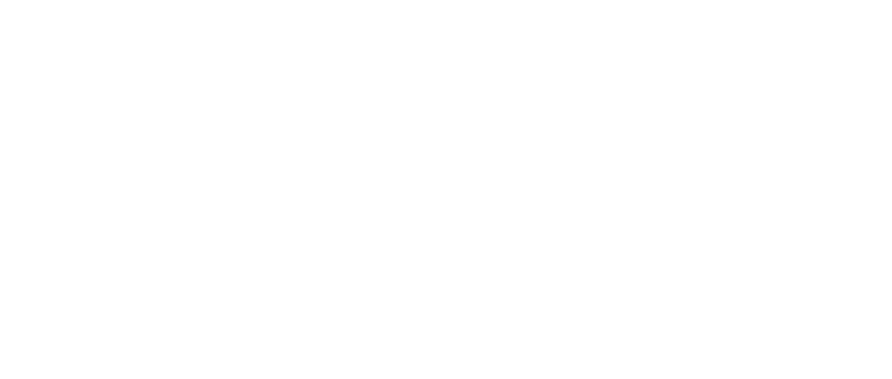

Braiins Forge s.r.o. is a newly born hardware-oriented company backed by Braiins. We're a small group of passionate developers who created the Braiins Miniminer and our current flagship product, the Braiins Deck. Here on GitHub, we publish open-source projects for enthusiasts who want to push their mining hardware beyond traditional use cases.

## Projects

- **[forge-doom](https://github.com/BraiinsForge/forge-doom)** - Play the classic DOOM on your Braiins Miniminer or Braiins Deck.
- **[fbterm](https://github.com/BraiinsForge/fbterm-deck-nix)** - Run a linux terminal on your Deck!

## About Our Hardware

Our projects target two main platforms:
- **[Braiins Miniminer (BMM-101)](https://braiins.com/hardware/mini-miner-bmm-101)** - A compact 1 TH/s home Bitcoin miner with a 3.5" touchscreen display, featuring Braiins OS and Stratum V2 support out of the box.
- **[Braiins Deck](https://braiins.com/hardware/braiins-deck)** - A desktop monitoring device with a 1280x480 touchscreen for displaying market data, blockchain information, and mining performance metrics.

## Get Involved

We're always excited to see what the community builds. If you have ideas for projects or improvements to existing ones, feel free to contribute or open an issue in any of our repositories.
